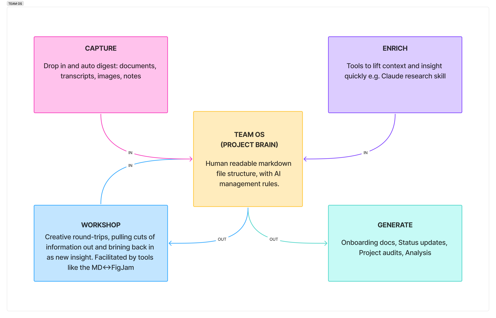

# Project brain

A shared memory system for design and strategy projects. Drop things in, AI organises them, knowledge compounds over time.

ℹ️ info: designed to be used within Cursor. it could be repurposed to be used with any LLM that can read and write documents locally.

## What this is

A project brain is a structured repository that accumulates everything important: research findings, stakeholder insights, decisions, and rationale. Everyone on the team keeps a copy on their machine and can query it with AI.

Unlike scattered docs or wikis that decay, a project brain:
- **Maintains itself** — you drop raw inputs in, AI extracts and files the useful stuff
- **Stays queryable** — ask questions in natural language, get answers grounded in actual project knowledge
- **Generates work** — draft updates, talking points, and analysis from accumulated understanding
- **Onboards instantly** — new team members get oriented quickly and in formats that work for them

### The problem it solves

On most projects:
- Good thinking gets repeated because no one remembers it happened
- Decisions get made but the rationale disappears
- Context lives in people's heads and gets lost between meetings
- AI tools produce generic output because they lack project context
- New people take weeks to get up to speed

This system fixes that by making you the **approver**, not the filer. You do the work. The brain remembers. AI does the organising.

### How it flows



| Flow | What goes in/out | How |
|------|------------------|-----|
| **Capture** | Docs, transcripts, images, quick notes | Drop in `_inbox/`, run `process inbox` |
| **Enrich** | Industry context, competitor research | Claude research skill generates context files |
| **Generate** | Onboarding guides, status updates, audits | Ask Cursor to draft from brain knowledge |
| **Workshop** | Insights, risks, decisions as stickies | `export for figjam` → work visually → `import from figjam` |

---

## How to use this

**Drop things in `_inbox/`.** That's it.

Then type `process inbox` in Cursor. AI extracts the useful stuff and proposes updates. You review and approve in `_pending/REVIEW.md`.

No filing. No remembering where things go. The structure maintains itself.

### The full workflow (still simple)

| Step | Action | Time |
|------|--------|------|
| 1 | Drop anything in `_inbox/` — notes, transcripts, thoughts | 5 sec |
| 2 | Type `process inbox` in Cursor | 2 sec |
| 3 | Review proposals in `_pending/REVIEW.md` | 5 min |
| 4 | Approve, edit, or reject each item | Done |

### Other commands

- `review pending` — walk through pending items interactively
- `what's in the brain?` — quick project orientation
- `summarise stakeholder [name]` — get a stakeholder summary

---

## Where things live

| What | Where |
|------|-------|
| Drop raw inputs here | `_inbox/` |
| AI proposals for review | `_pending/REVIEW.md` |
| Stakeholder profiles | `02_people/stakeholders/` |
| Themes, risks, opportunities | `03_discovery/synthesis/insights.md` |
| Decisions (ADRs) | `04_product/decisions/` |
| Problem framing | `04_product/problem-framing.md` |
| Org/industry context | `01_context/` |
| Design rationale | `05_design/` |
| Prototypes | `05_design/prototypes/` |
| Weekly updates | `06_delivery/updates/` |
| Integration tools | `Tools/` |

You don't need to memorise this — Cursor handles the filing.

---

## Quick links

- [Inbox](./_inbox/) — drop stuff here
- [Pending review](./_pending/REVIEW.md) — approve AI proposals
- [Stakeholders](./02_people/stakeholders/)
- [Insights](./03_discovery/synthesis/insights.md)
- [Decisions](./04_product/decisions/)
- [Tools](./Tools/) — integrations for moving data in/out

---

## What you can do with this

Everyone on the team keeps a copy of this brain on their machine. It's not just storage — it's a working tool.

### Ask questions

Open Cursor (or any AI tool that can read files) and ask:

- "What do we know about Sarah's concerns?"
- "Summarise the decisions we've made so far"
- "What are the main risks we've identified?"
- "What did we learn in the last round of interviews?"

The AI has context. Answers are grounded in actual project knowledge, not generic guesses.

### Generate work

Use the brain to draft real outputs:

- "Write a stakeholder update email for this week"
- "Draft talking points for the steering committee"
- "Compare our findings to what the client originally asked for"
- "Suggest what we should explore next based on the themes"

### Build prototypes

The brain includes structure for coded prototypes in `05_design/prototypes/`. This keeps prototype planning, builds, and learnings connected to the rest of the project knowledge.

**The workflow:**

1. **Start with a brief** — copy `_prototype-brief-template.md` into a new folder. Define your hypothesis, success criteria, and time box.

2. **Build the prototype** — code lives in the folder (simple builds) or link to an external repo (complex builds).

3. **Document learnings** — copy `_prototype-log-template.md` and capture what you validated, invalidated, and what surprised you.

4. **Close the loop** — if the prototype informs a decision, create or update an ADR. If it surfaces new insights, add them to `insights.md`.

**Example folder:**

```
05_design/prototypes/2025-01-04-checkout-flow-v2/
├── brief.md        ← What we're testing
├── log.md          ← What we learned
├── index.html      ← The build (or link to repo)
└── screenshots/    ← Visual documentation
```

Prototypes are disposable — they exist to learn, not to ship. The value is in the documented learnings that feed back into the brain.

### Stay in sync

Pull the latest changes from git. Everyone sees the same knowledge. New team members get oriented in minutes, not days.

---

## Tools

The project brain integrates with external tools to help move information in and out fluidly.

### Claude research skill

A skill for Claude that conducts desk research and generates structured context files for the brain. Team members can ask Claude to research clients, industries, or competitive landscapes — outputs land in `_pending/` ready for review.

**Setup:** See [Tools/Claude Research Skill/INTEGRATION-GUIDE.md](./Tools/Claude%20Research%20Skill/INTEGRATION-GUIDE.md)

**Example prompts:**
- "Research Acme Corp for the new project"
- "Build industry context for healthcare tech"
- "What's the competitive landscape in fintech lending?"

### MD ↔ FigJam plugin

A FigJam plugin that converts markdown into sticky notes. Export insights, risks, or stakeholder signals from the brain and paste them into FigJam for visual workshopping.

**Install:** [MD ↔ FigJam](https://www.figma.com/community/plugin/1588947011514620624/md-figjam) on the Figma Community

**Workflow:**
1. Ask Cursor to `export for figjam` with the content you want
2. Copy the output
3. Paste into the plugin in FigJam
4. Workshop, cluster, and refine on the canvas
5. Export from the plugin and paste back into Cursor to `import from figjam`

The cursor rules include colour conventions so exports are consistent:
- 🟡 Yellow — observations, quotes, raw signals
- 🔵 Blue — insights, themes, patterns
- 🟢 Green — opportunities, decisions, what's working
- 🔴 Red — risks, concerns, blockers
- 🟠 Orange — questions, things to explore

---

## As the project grows

Early on, everything is relevant. But as the brain accumulates knowledge, some things matter more than others.

You need to think about this when:
- The project has gone for a few iterations of decision making
- AI responses start feeling unfocused or pulling in old/stale content
- New team members ask "what should I actually read?"

### How to mark importance

Add simple frontmatter at the top of any document:

```yaml
---
status: active
importance: high
confidence: medium
---
```

**Status options:**
- `active` — current, relevant (default)
- `archived` — outdated, superseded, or no longer relevant
- `draft` — work in progress, not yet reliable

**Importance** (only add when notable):
- `high` — core to current work, read this first

**Confidence** (only add when uncertain):
- `low` — early hypothesis, needs validation
- `medium` — reasonable belief, some evidence
- `high` — well-established, strong evidence

### What this enables

When you ask Cursor questions, it can prioritise:
- Active over archived content
- High-importance documents over background material
- High-confidence insights over tentative ones

You can also ask things like:
- "What are our high-confidence themes?"
- "Show me active decisions only"
- "What's marked as low confidence that we should validate?"

### Moving things to archive

When something is no longer relevant:
1. Move the file to `_archive/`
2. Or just add `status: archived` to its frontmatter

Archived content isn't deleted — it's still searchable if you need history. It just stops cluttering current queries.

---

## Why this works

Most project knowledge lives in people's heads, scattered docs, or gets repeated in every meeting.

This system fixes that by making knowledge:
- **Queryable** — ask questions, get grounded answers
- **Generative** — produce new work from accumulated understanding
- **Shared** — everyone has the same context
- **Maintained by AI** — you drop stuff in, it organises

**You** do the thinking — conversations, research, design.
**The brain** remembers what was said and decided.
**AI** does the organising and retrieval.

If it ever feels like overhead, simplify. The structure serves you, not the other way around.
